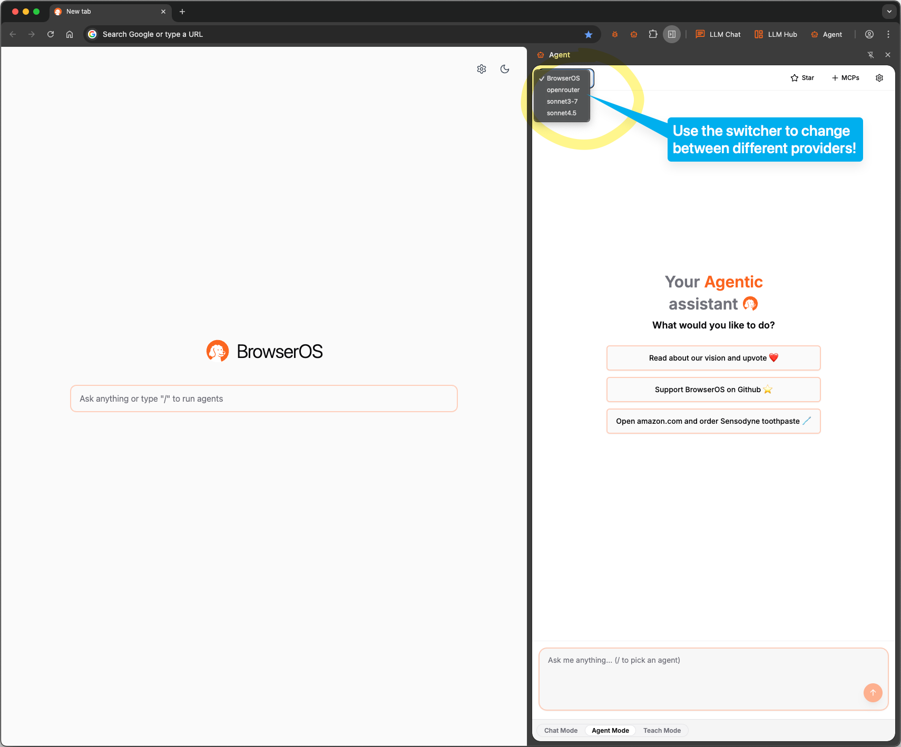

To use BrowserOS, you need to configure an LLM provider. You have two options:

1. **Use models locally** - Connect BrowserOS to models running on your machine
2. **Bring your own API keys** - Use cloud providers like ChatGPT, Gemini, or Claude

<Note>
  **Our recommendation:** BrowserOS works best with **Gemini 2.5 Flash**. We highly recommend getting an API key from Google AI Studio for Gemini 2.5 Flash. **Google AI Studio gives free access to Gemini 2.5 Flash models for up to 20 requests per minute** - perfect for getting started without any costs.
</Note>

## Why bring your own API keys or use local models?

<AccordionGroup>
  <Accordion title="🔒 Privacy - You control your data">
    Your API keys are stored locally and encrypted. Requests go directly from your browser to the provider - BrowserOS servers never see your data or keys. With local models, your data never even leaves your machine.
  </Accordion>
  <Accordion title="⚡ Rate limits - Avoid usage restrictions">
    BrowserOS has heavy rate limits on the default shared models. For the smoothest experience without interruptions, bring your own API keys or run models locally. Use BrowserOS as much as you want without hitting limits.
  </Accordion>
</AccordionGroup>

## Option #1: Bring your own keys to ChatGPT, Gemini, Claude! (Recommended)

Connect to powerful cloud models using your own API keys. BrowserOS works very well with Gemini 2.5 Flash - use it for the highest performance, fastest speed, and most stable experience.

### Available Cloud Providers

<CardGroup cols={4}>
  <Card
    title="Gemini (free)"
    href="/bring-your-own-keys/gemini"
  >
    Use Gemini-2.5-flash! Recommended.
  </Card>
  <Card
    title="Claude"
    href="/bring-your-own-keys/claude"
  >
    Use Claude sonnet-3.7 or sonnet-4.0!
  </Card>
  <Card
    title="OpenAI"
    href="/bring-your-own-keys/openai"
  >
    Use GPT-4.1 for best results!
  </Card>
  <Card
    title="Open Router"
    href="/bring-your-own-keys/openrouter"
  >
    Access multiple AI models through one API!
  </Card>
</CardGroup>

## Option #2: Using local AI LLM models

Running models locally gives you complete control and privacy. Your data stays on your machine, and there are no usage costs or API limits.

<Warning>
  NOTE: Local LLMs are great for "Chat Mode" tasks. For "Agent Mode" and "Teach Mode", our recommendation is to use bigger cloud based LLMs like ChatGPT, Gemini or Claude.
</Warning>

### Available Local Options

<CardGroup cols={3}>
  <Card title="Ollama" icon="robot" href="/local-LLMs/ollama">
    Popular tool for running open-source models locally with easy model management
  </Card>
  <Card title="LM Studio" icon="desktop" href="/local-LLMs/lm-studio">
    User-friendly GUI for downloading and managing local language models
  </Card>
  <Card title="GPT-OSS" icon="brain" href="/local-LLMs/gpt-oss">
    OpenAI's open-source GPT model optimized for local execution
  </Card>
</CardGroup>

### Recommended Models

For best results with local models:

- **gpt-oss:20B** - Great balance of speed and capability
- **qwen3:8B** or **qwen3:14B** - Fast and good for chat-mode, but struggles with agentic tasks

<Warning>
  Many models like Deepseek-R1 via Ollama don't support tool calls and you'll get `400` errors when trying to use them with BrowserOS. Stick with the recommended models above for the best experience.
</Warning>

## Switching Between Models

Use the switcher to change between different LLM providers.

- Use local models for sensitive work data
- Switch to cloud models for agentic tasks. 

## Next Steps

Once you've configured your LLM provider, explore what BrowserOS can do:

- Use **Chat Mode** for simple Q&A.
- Use **Agent Mode** for open-ended agentic tasks—tell the agent what to do and watch it execute step by step.
- Use **Teach Mode** to create repeatable workflows—show the BrowserOS agent your workflow once, and it will learn and repeat it reliably.