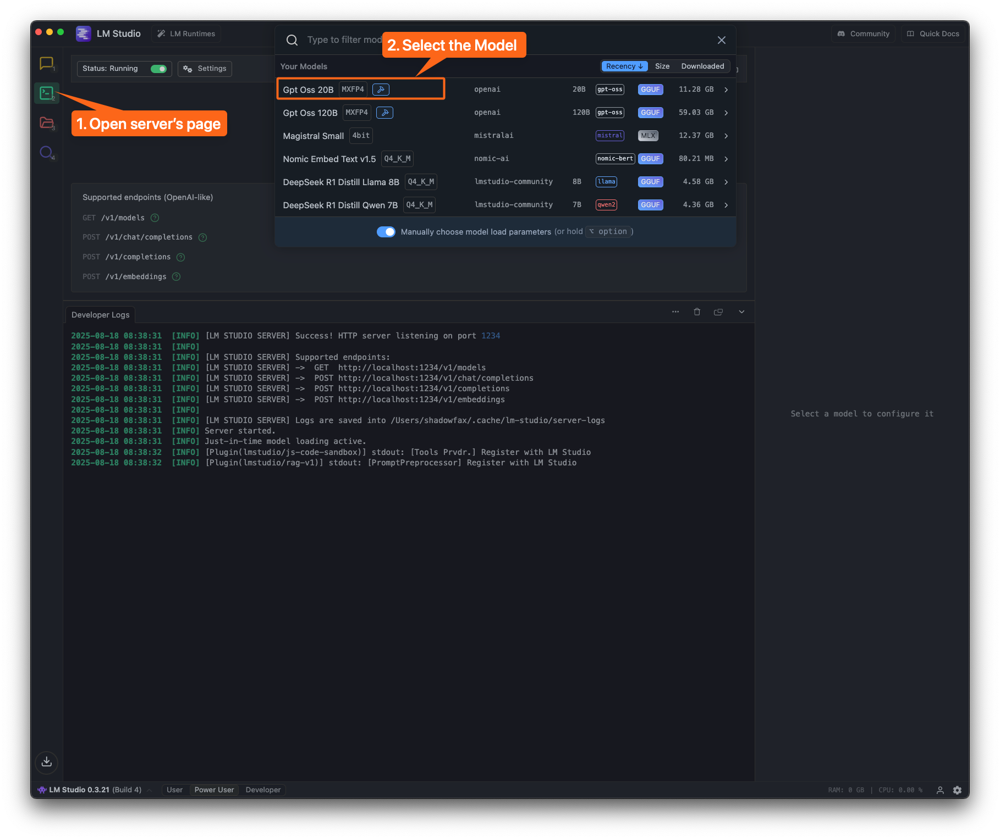
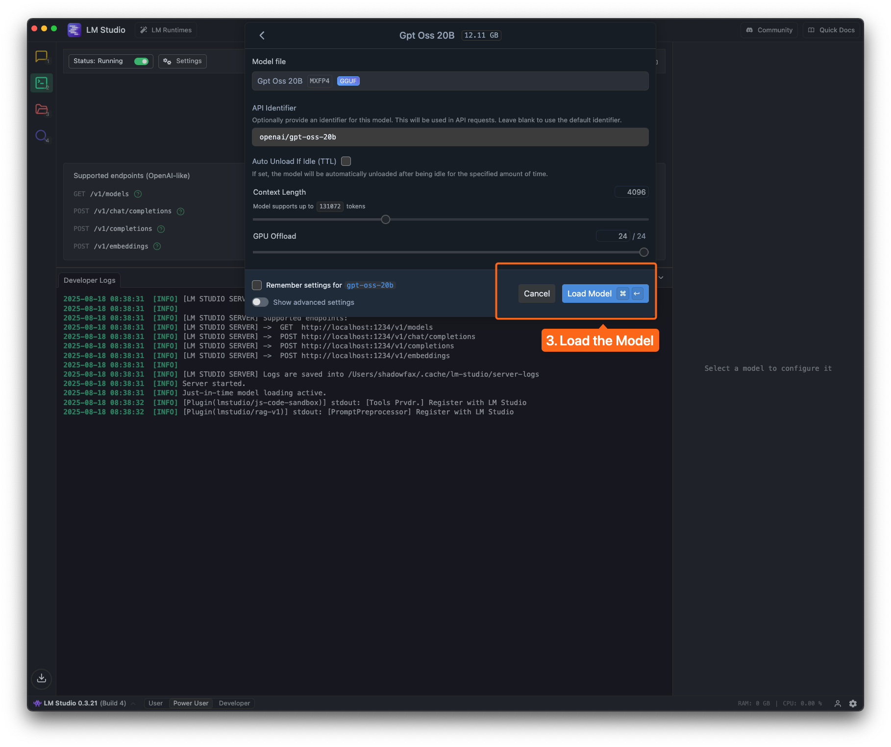
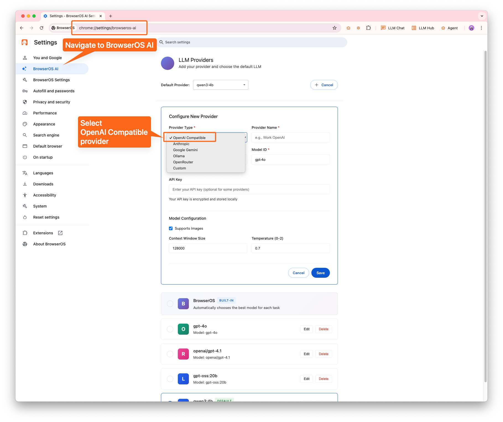
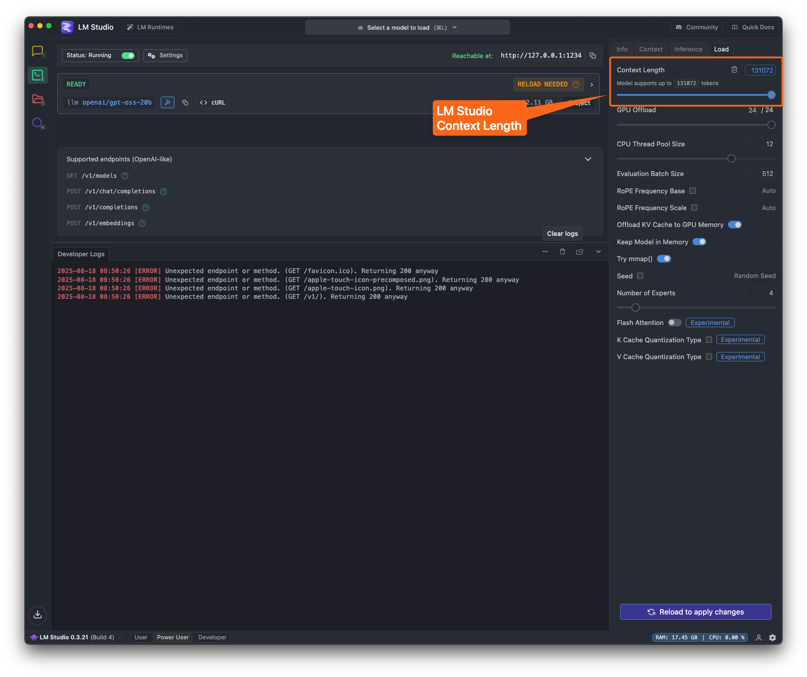
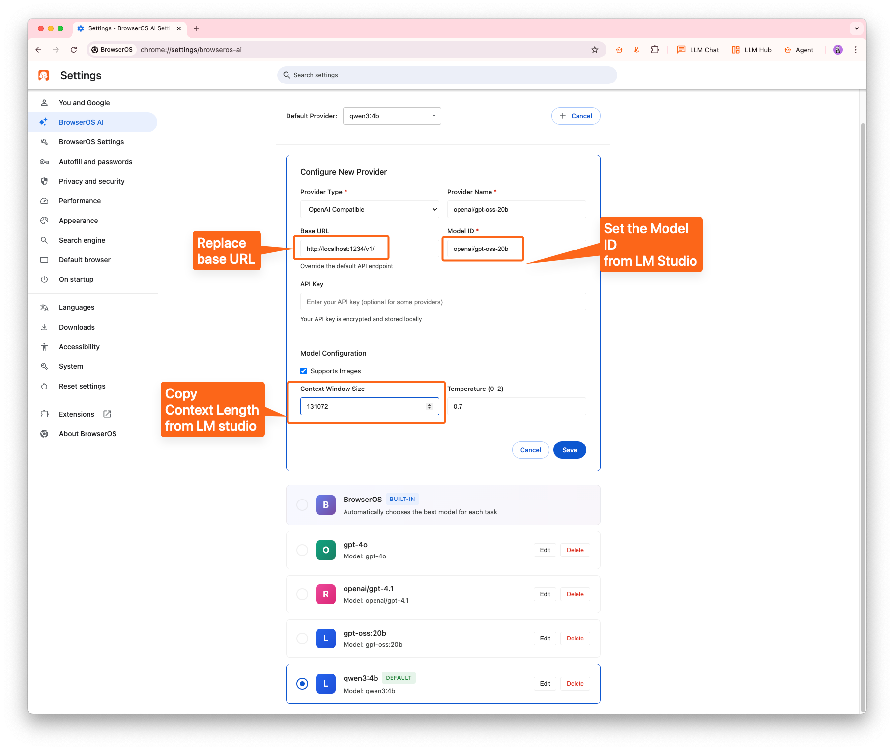

# Setting-up LM Studio with BrowserOS

## Step 1: Open LM Studio

Open LM Studio, navigate to the `Developer` page and select the desired model to load.

### Step 2: Load the model

In below example I’m loading `openai/gpt-oss-20b` model

### Step 3: Configure in BrowserOS

- Navigate to `chrome://settings/browseros-ai` or `Go to Settings -> BrowserOS AI`
- Click `Add Provider`
- Select `OpenAl Compatible` in `Provider Type` dropdown

### Step 4: Configure the Model

- Replace the Base URL with LM Studio URL, default is [`http://localhost:1234/v1/`](http://localhost:1234/v1/)
- Set the Model ID to the one you loaded in LM studio
- **💥 IMPORTANT:** Ensure you set the `Context Window Size` to what you configured in LM Studio.

### Step 5: Use the model in `BrowerOS` 🐶

- Select the model in BrowserOS agent and start using! 🎉

