# Using LM Studio + OpenAI’s gpt-oss

### STEP1: Setup LMStudio and download **OpenAI GPT-OSS**

1. Download LMStudio from https://lmstudio.ai/ 
    
2. Click on Discover in LMStudio, it should be the “🔍” icon on the left

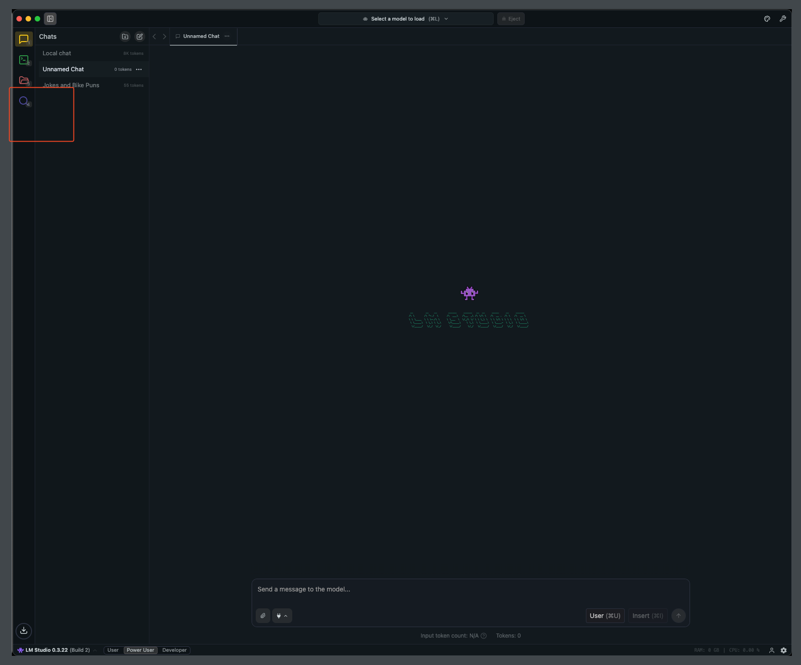

3. Search for gpt-oss-20b and click Download

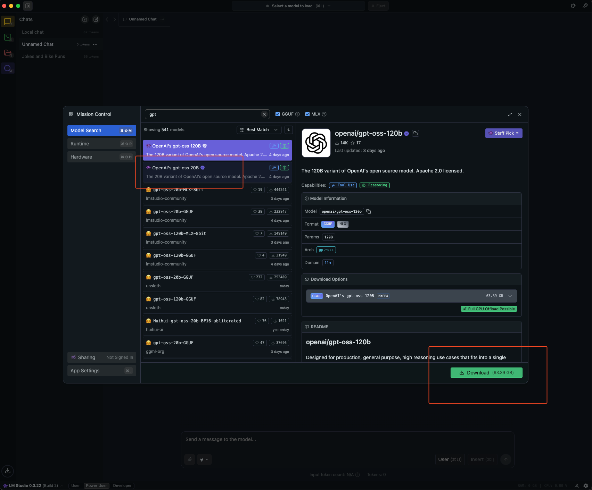

4. After download finishes, load the model. 

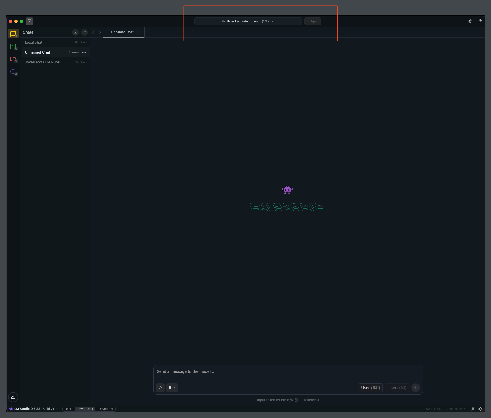

NOTE: Enable the flag to choose model parameters on load

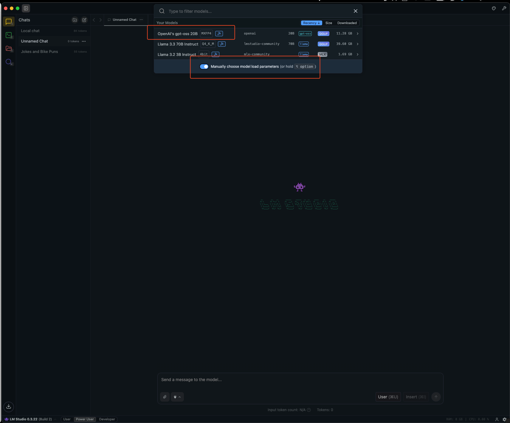

Set context length to 32768, depending on your hardware and load the model

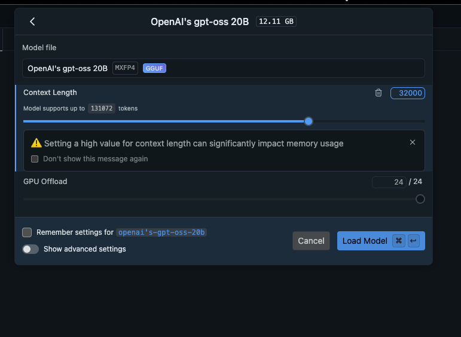

### STEP2: Configure BrowserOS to use LMStudio

1. Add Provider from `chrome://settings/browseros-ai`

2. Choose Provider Type as “OpenAI Compatible”

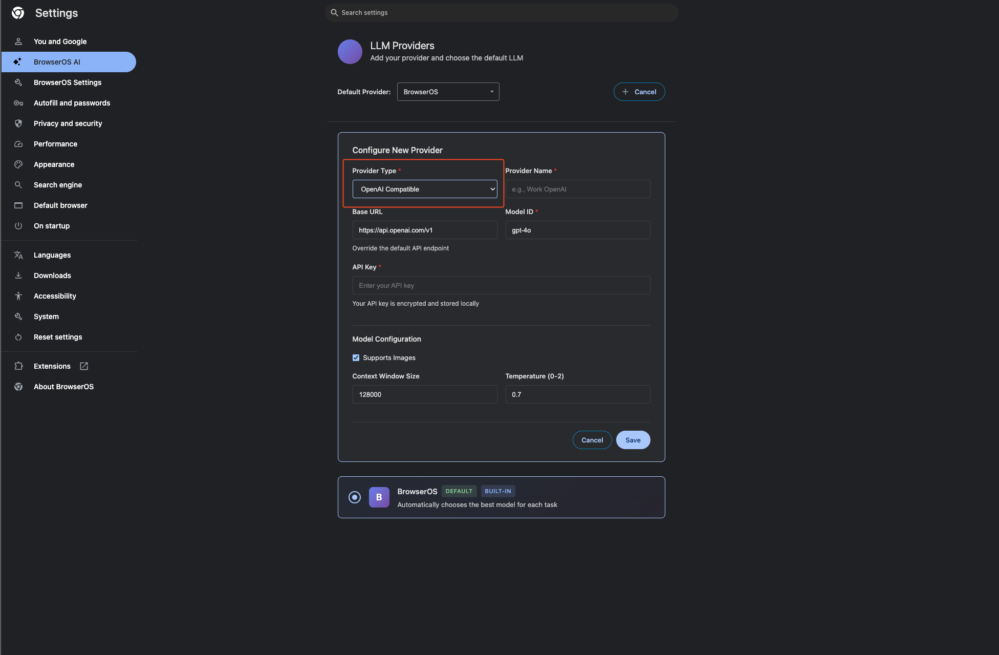

3. Set Base URL to http://127.0.0.1:1234/v1 and model ID to openai/gpt-oss-20b and set context length to 32768 and save!

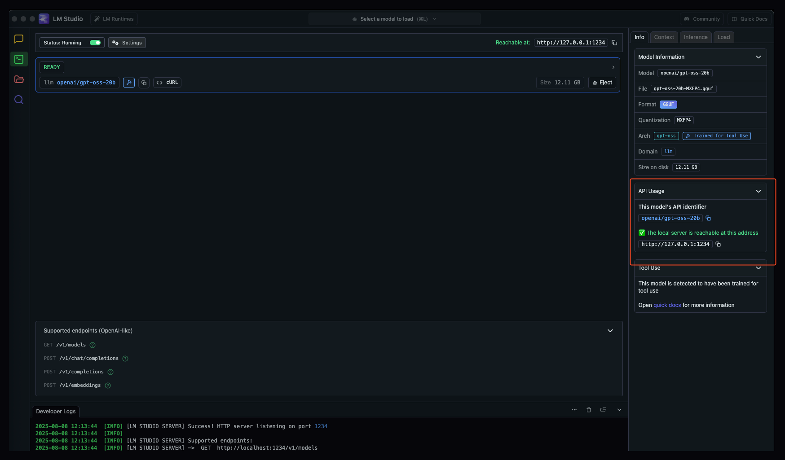

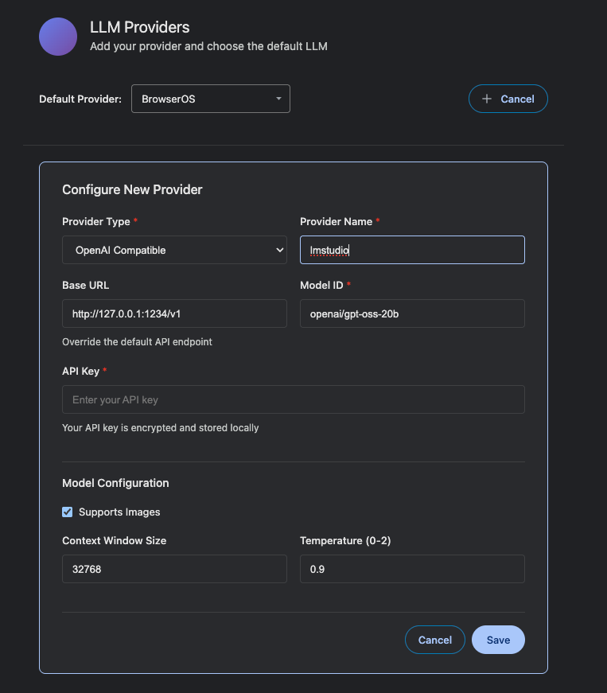

4. Change the default provider to lmstudio and you are good to go!

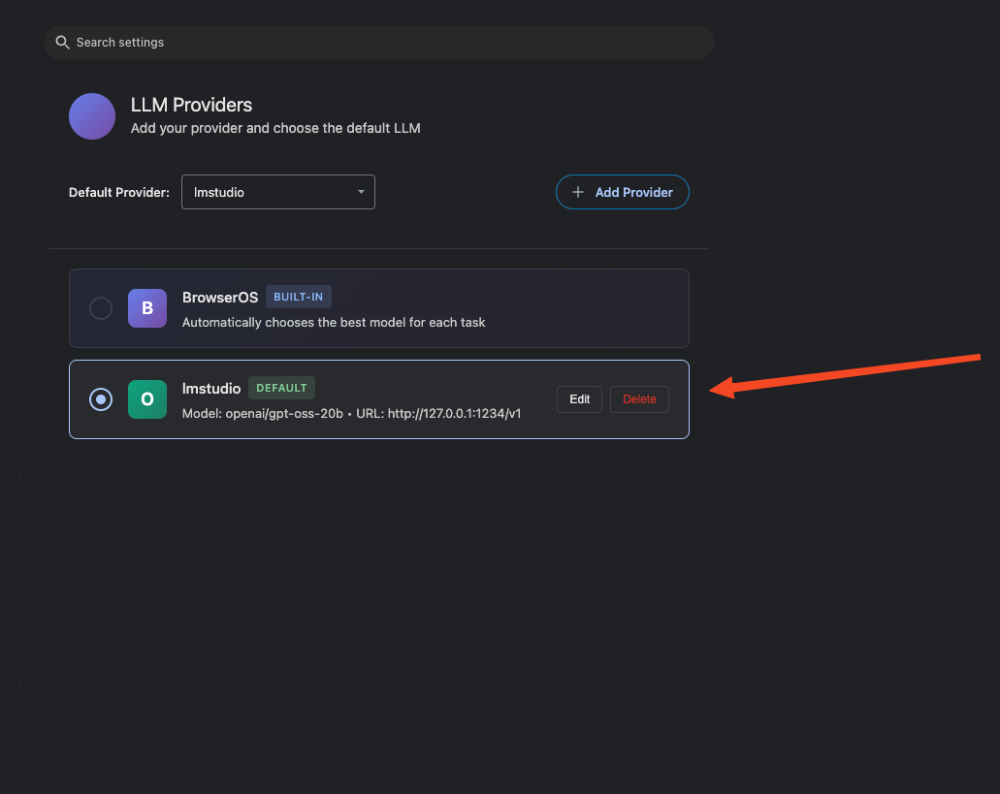

5. You can gpt-oss from Agent!

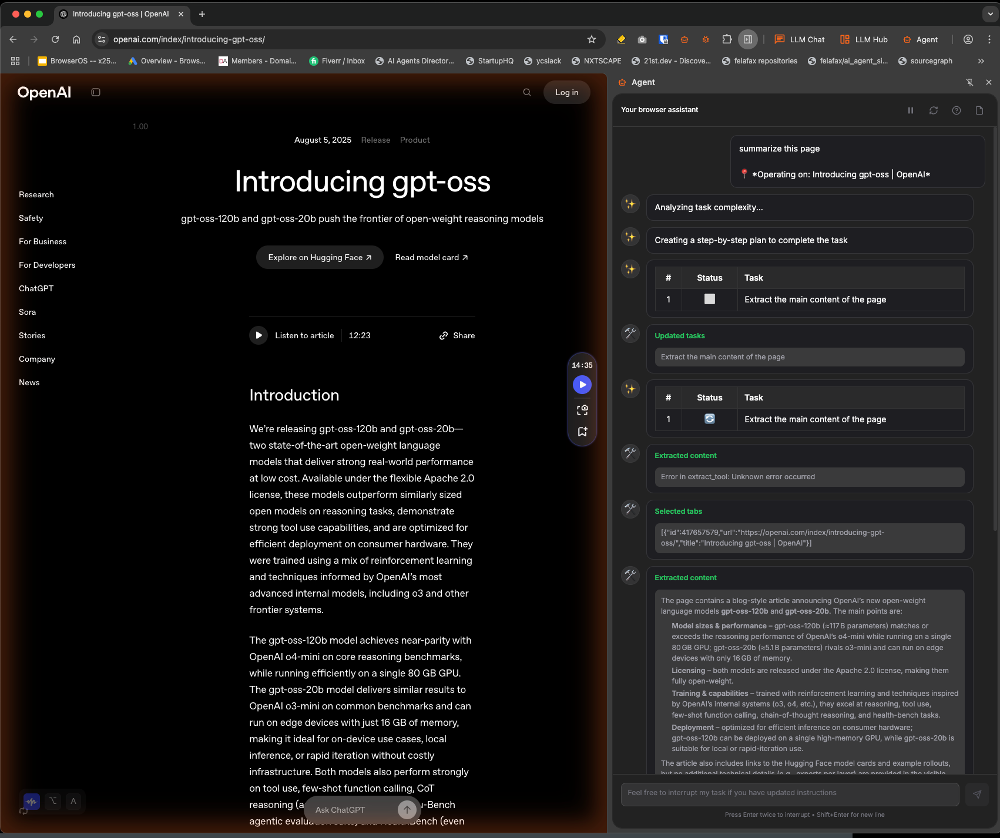

If everything is setup you should see messages on the LMStudio, like below.

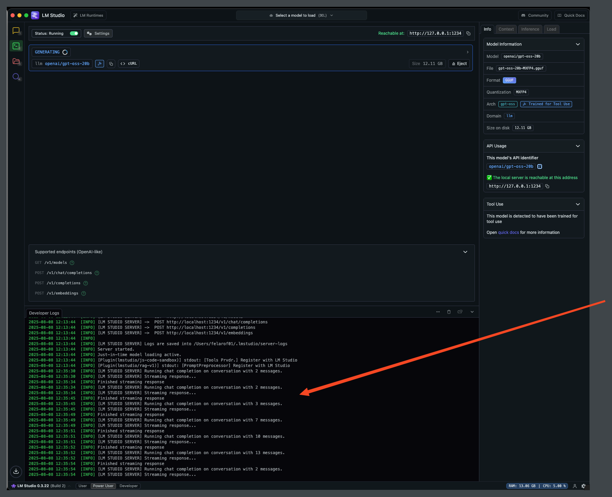